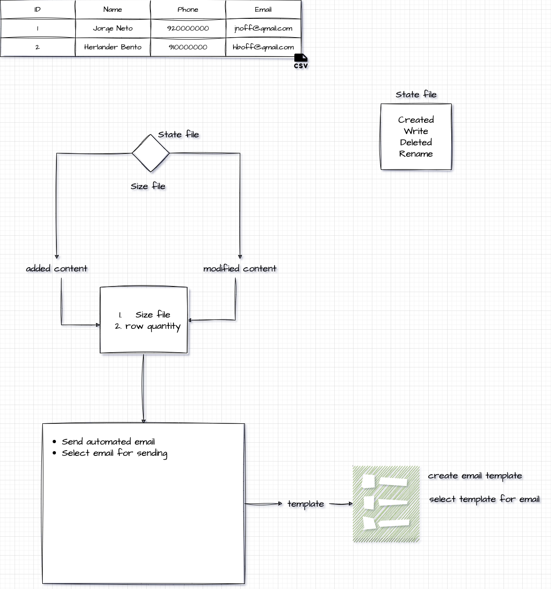

# Ula

Ula is a tool that sends emails by reading a file, with several possibilities, such as scheduling, sending by selection, filling, and automatic sending.

The tool was built focusing on the need of those who use spreadsheets with the need to send emails to the existing records in this spreadsheet.

Customized emails with possibilities to export existing template.

## Usage

To use the tool you must have a csv file with the following structure:

```
email or Email
```

The tool has a web interface that allows you to upload the file and send the emails.
To run the web interface you must run the command `server -p 8080`, access the page *localhost:8080* and you can upload the file.

To send the emails you have to use the event command.
This command hears the changes that occur in the director */example/file*.
The event command must be accompanied by some arguments to complete it.
`event -h` for more information.

### Command Line Options

`go run main.go -h`

```bash
Usage:
  ula [flags]
  ula [command]

Available Commands:
  completion  Generate the autocompletion script for the specified shell
  event       Ula watcher of system event
  help        Help about any command
  server      Ula server

Flags:
  -h, --help      help for ula
  -v, --version   version for ula

Use "ula [command] --help" for more information about a command.
```

Command to send emails:


## Installation

multiplataform (linux, windows, mac)

### Linux

### Windows

### Mac


## System Design

### Architecture

Image 1 - Architecture



Image 2 - Architecture
